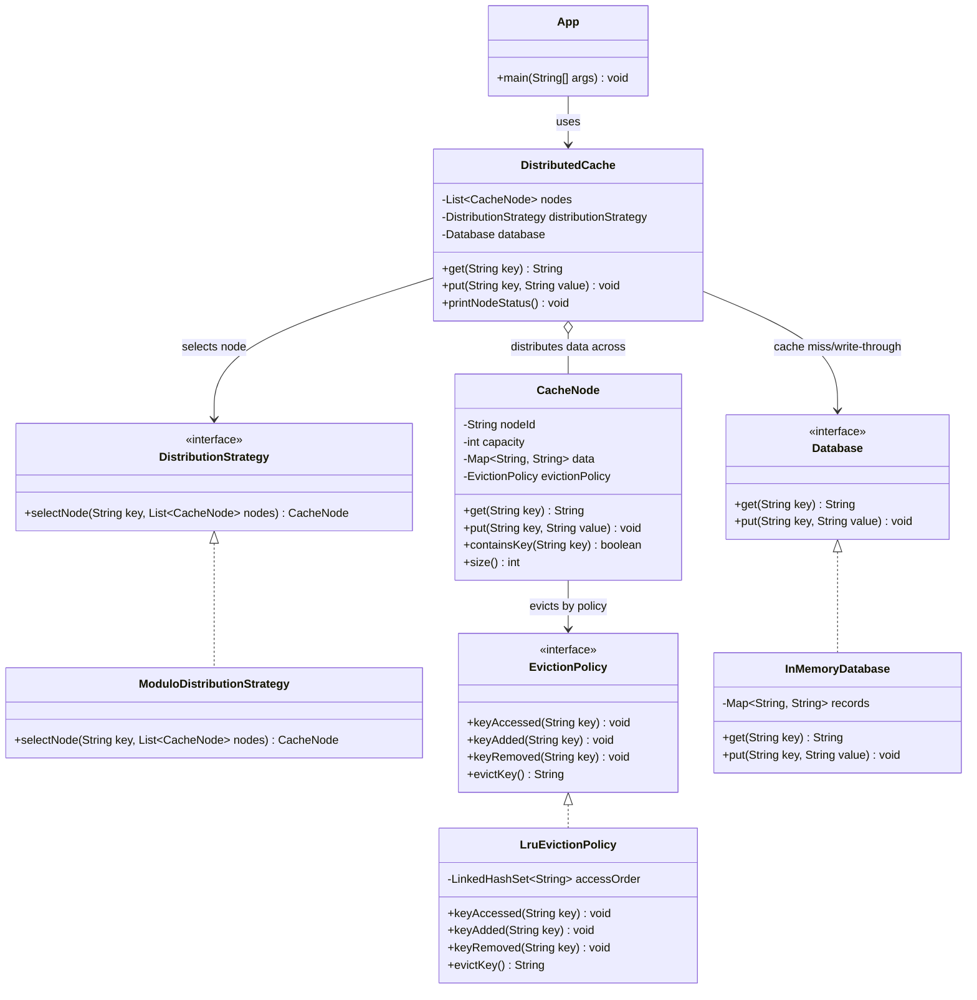

# Distributed Cache Design

## 1. Problem Statement
Design and implement an in-memory distributed cache system that supports:

- `get(key)`
- `put(key, value)`

The cache is distributed across multiple configurable cache nodes. Each node has limited capacity and uses LRU eviction in the current implementation.

## 2. Assumptions
- Keys are unique.
- This is an in-memory LLD exercise, so there is no real network communication between cache nodes.
- `put(key, value)` writes to both cache and database, following a write-through assumption.
- On `get(key)`, if the key is not present in cache, the system fetches it from the database, stores it in cache, and returns it.
- If the key is not present in database either, `null` is returned.

## 3. Class Diagram


## 4. Data Distribution Across Nodes
`DistributedCache` does not decide node placement by itself. It delegates that decision to `DistributionStrategy`.

The current strategy is `ModuloDistributionStrategy`:

```text
nodeIndex = abs(hash(key)) % numberOfNodes
```

Example:

```text
key = "user:1"
hash("user:1") % 3 = 1
data goes to CacheNode-2
```

This keeps distribution pluggable. Later, we can add `ConsistentHashingDistributionStrategy` without changing `DistributedCache` or `CacheNode`.

## 5. Cache Miss Handling
When `get(key)` is called:

```text
Client
  |
  v
DistributedCache.get(key)
  |
  v
DistributionStrategy selects node
  |
  v
CacheNode.get(key)
  |
  +-- hit  -> return cached value
  |
  +-- miss -> Database.get(key)
              |
              +-- found     -> CacheNode.put(key, value), return value
              +-- not found -> return null
```

This is a read-through cache behavior.

## 6. Put Handling
When `put(key, value)` is called:

1. `DistributedCache` selects the target node using the distribution strategy.
2. The selected `CacheNode` stores the value.
3. The database is also updated.

This assignment assumes write-through behavior, so database and cache stay consistent for direct writes through the cache service.

## 7. Eviction
Each `CacheNode` has limited capacity.

The current eviction policy is LRU:

- every `get` marks the key as recently used
- every `put` marks the key as recently used
- when the node is full, the least recently used key is removed

The cache node depends on the `EvictionPolicy` interface, not on LRU directly.
This means future policies like MRU or LFU can be added as new classes.

## 8. Extensibility

### Distribution Strategy
Current:
- `ModuloDistributionStrategy`

Future:
- `ConsistentHashingDistributionStrategy`
- `MapBasedRoutingStrategy`

Only the strategy implementation changes. The cache service remains the same.

### Eviction Policy
Current:
- `LruEvictionPolicy`

Future:
- `MruEvictionPolicy`
- `LfuEvictionPolicy`

Only the eviction implementation changes. `CacheNode` continues using the same `EvictionPolicy` interface.

### Database
Current:
- `InMemoryDatabase`

Future:
- SQL database adapter
- NoSQL database adapter
- remote service adapter

The cache depends only on the `Database` interface.

## 9. Build And Run
```bash
cd distributed-cache/src
javac com/example/distributedcache/*.java
java com.example.distributedcache.App
```

## 10. Sample Output
```text
PUT user:1 = Nachiket
PUT user:2 = Aman
PUT user:3 = Riya
GET user:1 -> Nachiket
GET user:4 -> Priya
GET user:9 -> null
PUT user:7 = Isha (triggers LRU eviction on its node)
CacheNode-1 size=1 data={user:3=Riya}
CacheNode-2 size=2 data={user:4=Priya, user:7=Isha}
CacheNode-3 size=1 data={user:2=Aman}
```

## 11. Interview Summary
“I designed the distributed cache with a facade service, multiple cache nodes, a pluggable distribution strategy, a pluggable eviction policy, and a database abstraction. The current implementation uses modulo-based routing and LRU eviction, while keeping the design open for consistent hashing and other eviction policies.”
