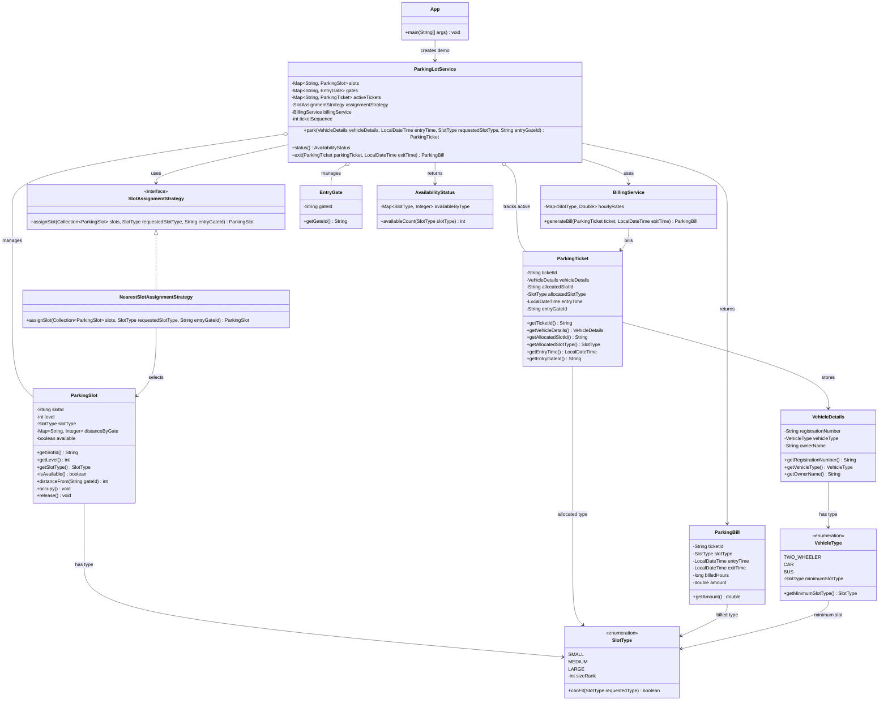

# Parking Lot UML Diagram

```mermaid
classDiagram
    class ParkingLotService {
        -Map~String, ParkingSlot~ slots
        -Map~String, EntryGate~ gates
        -Map~String, ParkingTicket~ activeTickets
        -SlotAssignmentStrategy assignmentStrategy
        -BillingService billingService
        -int ticketSequence
        +park(VehicleDetails vehicleDetails, LocalDateTime entryTime, SlotType requestedSlotType, String entryGateId) ParkingTicket
        +status() AvailabilityStatus
        +exit(ParkingTicket parkingTicket, LocalDateTime exitTime) ParkingBill
    }

    class SlotAssignmentStrategy {
        <<interface>>
        +assignSlot(Collection~ParkingSlot~ slots, SlotType requestedSlotType, String entryGateId) ParkingSlot
    }

    class NearestSlotAssignmentStrategy {
        +assignSlot(Collection~ParkingSlot~ slots, SlotType requestedSlotType, String entryGateId) ParkingSlot
    }

    class BillingService {
        -Map~SlotType, Double~ hourlyRates
        +generateBill(ParkingTicket ticket, LocalDateTime exitTime) ParkingBill
    }

    class ParkingSlot {
        -String slotId
        -int level
        -SlotType slotType
        -Map~String, Integer~ distanceByGate
        -boolean available
        +getSlotId() String
        +getLevel() int
        +getSlotType() SlotType
        +isAvailable() boolean
        +distanceFrom(String gateId) int
        +occupy() void
        +release() void
    }

    class EntryGate {
        -String gateId
        +getGateId() String
    }

    class VehicleDetails {
        -String registrationNumber
        -VehicleType vehicleType
        -String ownerName
        +getRegistrationNumber() String
        +getVehicleType() VehicleType
        +getOwnerName() String
    }

    class ParkingTicket {
        -String ticketId
        -VehicleDetails vehicleDetails
        -String allocatedSlotId
        -SlotType allocatedSlotType
        -LocalDateTime entryTime
        -String entryGateId
        +getTicketId() String
        +getVehicleDetails() VehicleDetails
        +getAllocatedSlotId() String
        +getAllocatedSlotType() SlotType
        +getEntryTime() LocalDateTime
        +getEntryGateId() String
    }

    class ParkingBill {
        -String ticketId
        -SlotType slotType
        -LocalDateTime entryTime
        -LocalDateTime exitTime
        -long billedHours
        -double amount
        +getAmount() double
    }

    class AvailabilityStatus {
        -Map~SlotType, Integer~ availableByType
        +availableCount(SlotType slotType) int
    }

    class SlotType {
        <<enumeration>>
        SMALL
        MEDIUM
        LARGE
        -int sizeRank
        +canFit(SlotType requestedType) boolean
    }

    class VehicleType {
        <<enumeration>>
        TWO_WHEELER
        CAR
        BUS
        -SlotType minimumSlotType
        +getMinimumSlotType() SlotType
    }

    class App {
        +main(String[] args) void
    }

    ParkingLotService o-- ParkingSlot : manages
    ParkingLotService o-- EntryGate : manages
    ParkingLotService o-- ParkingTicket : tracks active
    ParkingLotService --> SlotAssignmentStrategy : uses
    ParkingLotService --> BillingService : uses
    ParkingLotService --> AvailabilityStatus : returns
    ParkingLotService --> ParkingBill : returns

    SlotAssignmentStrategy <|.. NearestSlotAssignmentStrategy

    ParkingSlot --> SlotType : has type
    ParkingTicket --> VehicleDetails : stores
    ParkingTicket --> SlotType : allocated type
    ParkingBill --> SlotType : billed type
    VehicleDetails --> VehicleType : has type
    VehicleType --> SlotType : minimum slot

    BillingService --> ParkingTicket : bills
    NearestSlotAssignmentStrategy --> ParkingSlot : selects
    App --> ParkingLotService : creates demo
```

