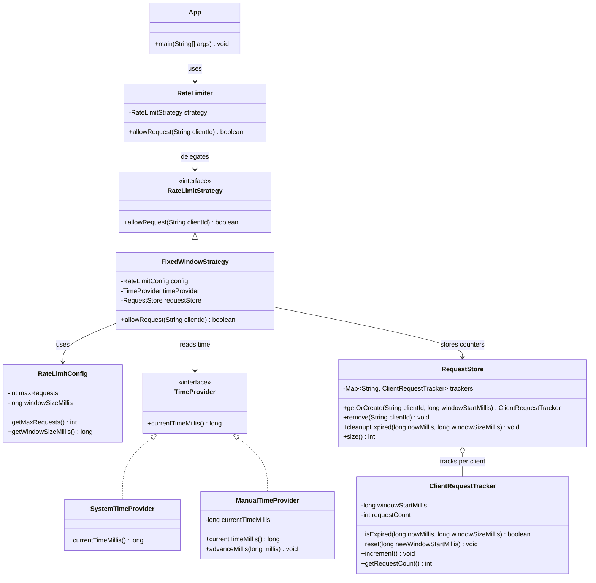

# Rate Limiter Design

## 1. Problem Statement
Design and implement an in-memory rate limiter that controls how frequently a client can make requests.

The system supports:

```text
allowRequest(clientId)
```

For the current implementation, each client is allowed `N` requests per `T` time window.

Example:

```text
3 requests per 10 seconds
```

## 2. Assumptions
- `clientId` uniquely identifies a user or client.
- This is an in-memory LLD exercise.
- No distributed systems or networking are required.
- Current algorithm: Fixed Window Counter.
- Thread safety is handled using synchronized store operations.
- Time is accessed only through a `TimeProvider` abstraction.

## 3. Class Diagram


## 4. How Rate Limiting Is Enforced
`RateLimiter` is the public facade.
It does not know the algorithm details. It delegates every call to a `RateLimitStrategy`.

For the current implementation, `FixedWindowStrategy` is used.

When `allowRequest(clientId)` is called:

1. Read current time through `TimeProvider`.
2. Find the current window start for that timestamp.
3. Get the client's `ClientRequestTracker` from `RequestStore`.
4. If the tracker's window is expired, reset it.
5. If the request count is below the limit, increment and return `true`.
6. If the request count has reached the limit, return `false`.

## 5. Fixed Window Handling
The window is calculated like this:

```text
windowStart = currentTimeMillis - (currentTimeMillis % windowSizeMillis)
```

Example with a 10 second window:

```text
00s to 09s -> window 0
10s to 19s -> window 10
20s to 29s -> window 20
```

Boundary behavior:
- If a client has used all requests in the current window, the next request is rejected.
- When time moves into a new window, the counter resets.
- This means a client may make requests near a boundary and again immediately after the next window starts. That is expected behavior for Fixed Window Counter.

## 6. Request Rejection
If the client has already used `N` requests in the active window:

```text
allowRequest(clientId) -> false
```

No counter update happens for rejected requests.

## 7. Data Cleanup
The `RequestStore` stores one tracker per active client.

To avoid memory leaks:
- `FixedWindowStrategy` calls `cleanupExpired(...)` on every request.
- Trackers older than the current active window are removed.
- The store is synchronized to keep reads/writes safe in simple multi-threaded usage.

## 8. Extensibility
The algorithm is hidden behind `RateLimitStrategy`.

Current:
- `FixedWindowStrategy`

Future strategies can be added without changing `RateLimiter`:
- `SlidingWindowLogStrategy`
- `SlidingWindowCounterStrategy`
- `TokenBucketStrategy`
- `LeakyBucketStrategy`

The system also uses `TimeProvider`, so tests can use `ManualTimeProvider` instead of real system time.

## 9. Build And Run
```bash
cd rate-limiter/src
javac com/example/ratelimiter/*.java
java com.example.ratelimiter.App
```

## 10. Sample Output
```text
Limit: 3 requests per 10 seconds
Request 1 allowed=true
Request 2 allowed=true
Request 3 allowed=true
Request 4 allowed=false
Advancing time by 10 seconds...
Request 5 allowed=true
Store size after cleanup=1
```

## 11. Interview Summary
“I designed the rate limiter with a facade, a pluggable strategy interface, a fixed-window implementation, a time provider abstraction, and a synchronized request store. The design currently supports N requests per T window and can be extended with sliding window, token bucket, or leaky bucket strategies without changing the facade.”
